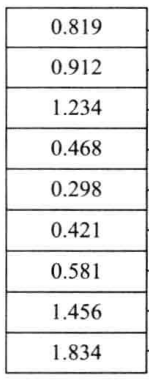
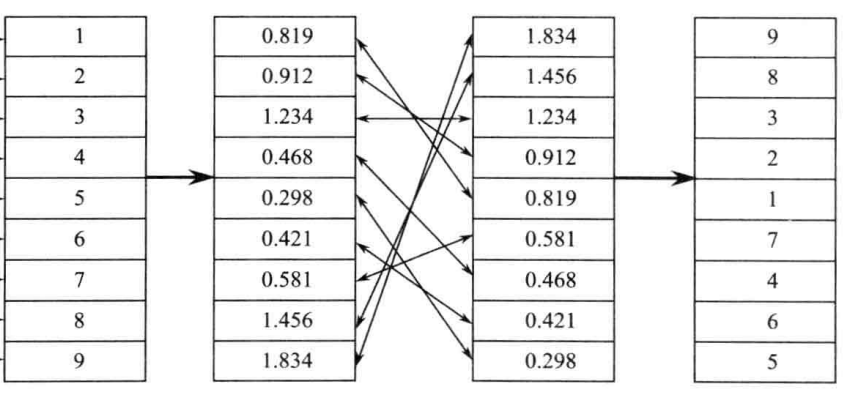
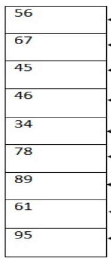
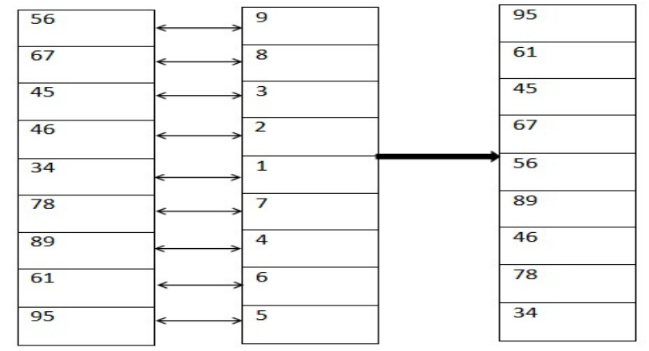
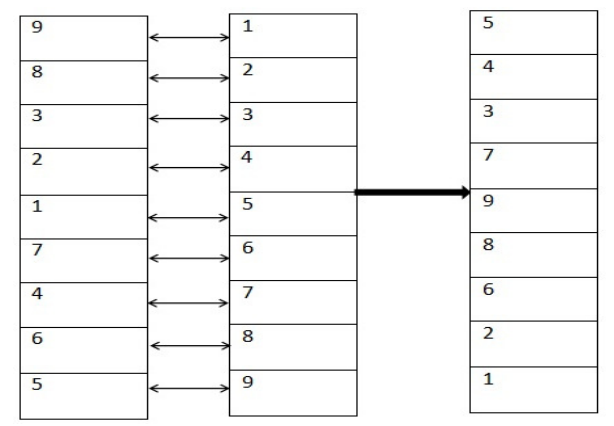
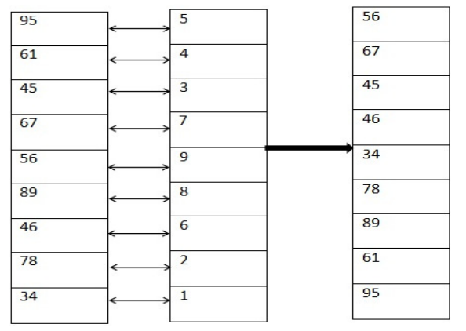

# Henon 混沌加密

Henon混沌序列：
$$
x_{n+1} = 1 - a*x_{n}*x_{n}+y_{n}\\
y_{n+1} = b*x_{n}
$$

a = 1.4;b=0.3;$y_{0}$=0将会产生混沌序列。使用不同的初值$x_{0}$将会产生不同的混沌序列。

## 加密

第一，需要产生图片像素三倍的混沌序列（225X225像素的图片，需要产生225X225X3=151875长度混沌序列）。

第二，将混沌序列值进行排序，得到加密序列。

以9个混沌值为例：

将这9个混沌值进行降序排序，得到加密序列`9 8 3 2 1 7 4 6 5`

第三，将图片的降成一维向量，按照RGB的顺序存储。

下图9个值就是图片降维的一维向量，其中`56 67 45`代表R通道的灰度值、`46 34 78`代表G通道的灰度值、`89 61 95`代表B通道的灰度值。

第四，将图片的一维向量按照加密序列的规则进行加密。

最左边的序列是图片的一维向量，中间是加密序列，最右边是加密后的图片一维向量。

最上一个元素的脚标为1，最下一个元素的脚标为9。

规则是：看加密序列中的第1个元素为9，代表最左边图片的一维向量中的第9个元素放在该位置上。

再比如加密序列中的第6个元素为7，代表最左边图片的一维向量中的第7个元素放在该位置上。结果就是加密后的图片一维向量（最右边）。

之后将加密后图片的一维向量还原成图片即可。

## 解密

主要是要生成解密序列，还是以上面的加密序列为例，说明如何生成解密序列。

最左边的序列是加密序列，中间的序列是映射关系（值是顺序的1~9），最右边是生成的解密序列。

最上一个元素的脚标为1，最下一个元素的脚标为9。

第一个映射关系是F(9) = 1，代表的是在**加密**过程中，我们将原始图片的第9个值放在了第1个位置上。要解密的话，需要在解密序列中将加密图片序列的第1个值映射到第9个位置上。

再比如F(7) = 6 这一映射，在解密序列中代表第7个位置放6。

解密过程如图：

最左边的序列是加密图片序列，中间的序列是解密序列，最右边是生成的解密图片序列。

可以看出，加密图片序列中的第1个值，被放到了解密序列中的第9个位置，解密序列的使用相同于加密序列。比如第9个值为1，代表这个位置放置加密图片序列的第一个值。
